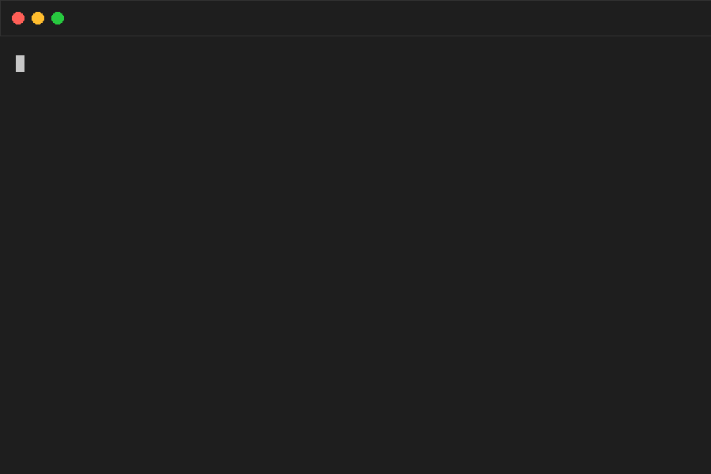
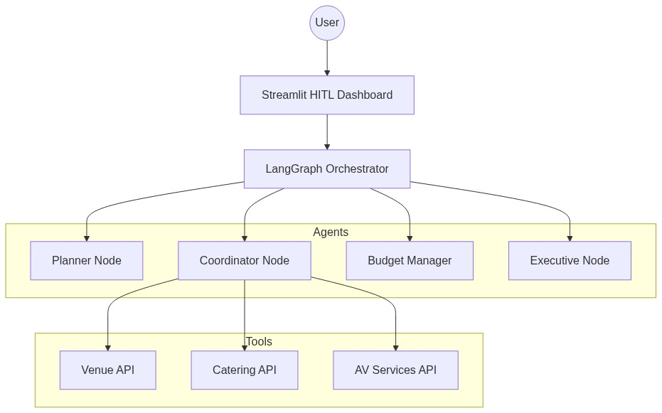
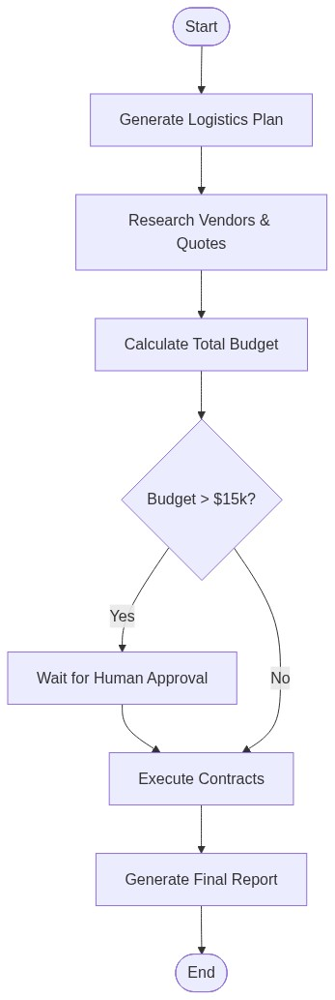
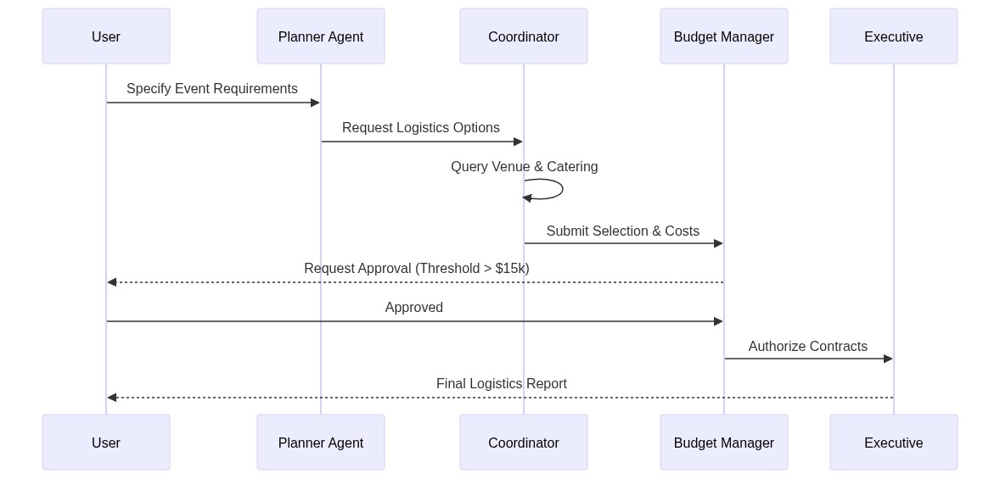

# EventSync-AI: Autonomous Corporate Event Logistics Orchestrator

### Subtitle: How I Automated Enterprise Event Coordination Using LangGraph Swarms and Human-in-the-Loop Governance



## Overview
EventSync-AI is a high-fidelity experimental PoC designed to manage the chaos of corporate event planning. By utilizing a multi-agent architecture powered by **LangGraph**, it autonomous coordinates between planning, vendor selection, and budget auditing, while maintaining strict Human-in-the-Loop (HITL) guardrails for high-stakes financial commitments.

## Key Features
1. **Multi-Agent Orchestration**: Separate specialized nodes for Planning, Coordination, and Budgeting.
2. **Dynamic Vendor Integration**: Robust mock tools simulating real-world hospitality and catering APIs.
3. **HITL Governance**: Streamlit-based dashboard for explicit user approval of expenditures exceeding $15,000.
4. **Self-Healing Logistics**: Automatic re-calculation and vendor fallback logic.

## Architecture


## Process Flow


## Tech Stack
- **Core Orchestration**: [LangGraph](https://github.com/langchain-ai/langgraph)
- **Agent Framework**: LangChain + GPT-4o
- **UI/Dashboard**: Streamlit
- **Diagrams**: Mermaid.js
- **Environment**: Python 3.12+

## Getting Started
1. Clone the repository: `git clone <REPO_URL>`
2. Install dependencies: `pip install -r requirements.txt`
3. Set your `OPENAI_API_KEY` in a `.env` file.
4. Run the terminal simulation: `python main.py`
5. Launch the HITL dashboard: `streamlit run app.py`

## Project Structure
```text
.
├── app.py              # Streamlit HITL Dashboard
├── agents.py           # LangGraph workflow and agent definitions
├── main.py             # CLI Simulation entry point
├── tools.py            # Mock Hospitality/Catering tools
├── generate_diagrams.py # Asset generation script
├── generate_gif.py      # Terminal animation generator
└── images/             # Visual assets (Diagrams & GIFs)
```

## Sequence Flow


---
*Disclaimer: This project is an experimental PoC and not intended for production use without further hardening and real API integrations.*
